# Food Guardian 😋

Food Guardian révolutionne votre expérience d'achat alimentaire en scannant, sécurisant et informant instantanément sur chaque produit pour des courses sans stress ni danger.

# Table des matières 📖

1. [Food Guardian 😋](#food-guardian-)
2. [📁 Présentation des Principaux Dossiers](#-présentation-des-principaux-dossiers)
3. [🚀 Présentation de l'Application](#-présentation-de-lapplication)
4. [🌐 Étude de l'Existant](#-étude-de-lexistant)
   - [Applications Concurrentes](#applications-concurrentes-)
5. [🎯 Public Cible](#-public-cible)
6. [📋 Fonctionnalités](#-fonctionnalités)
   - [Déscription des Personas](#déscription-des-personas)
   - [Enregistrement et profils des utilisateurs](#enregistrement-et-profils-des-utilisateurs-)
   - [Lecteur de codes-barres](#lecteur-de-codes-barres-)
   - [Détection des allergènes](#détection-des-allergènes-)
   - [Détails du produit](#détails-du-produit-)
   <!--- [Alertes utilisateur](#alertes-utilisateur-)
   - [Recherche et filtrage de produits](#recherche-et-filtrage-de-produits-)
   - [Avis et évaluations des utilisateurs](#avis-et-évaluations-des-utilisateurs-)-->
   - [Produits favoris](#produits-favoris-)
   - [Recommandations](#recommandations-)
   - [Paramètres](#paramètres-)
7. [📈 État d'Avancement](#-état-davancement)
8. [⚙️ Compilation de l'Application](#-compilation-de-lapplication)

## 📁 Présentation des Principaux Dossiers

~~~text
food_guardian/
│
├── lib/
│   ├── screens/
│   ├── styles/
│   ├── utils/
│   ├── widgets/
│   │
│   └── main.dart
│
├── assets/
│   ├── icons/
│   ├── images/
│   ├── ...
│
└── android/
~~~

<!-- - `/maquettes`: Contient les maquettes visuelles de l'application. -->
- `/lib`: Ce dossier est l'endroit où vous définissez les fonctionnalités de base de votre application. Il contient les fichiers **main.dart**, **routes.dart**, et le fichier automatiquement généré **firebase_options.dart**. En outre il contient une série de dossiers:
  - `/screens`: Contient les différents écrans de l'application
  - `/styles`: Contient les fichiers définissant les font, couleurs, dimensions et autres styles utilisés dans l'application
  - `/utils`: Contient des fichiers présentant une série d'utilités comme la validation des forms
  - `/widgets`: Contient les différents widgets utilisés à travers, la plupart du temps, dans plusieurs écrans de l'application
- `/assets`: 
- `/android`:

## 🚀 Présentation de l'Application

Bienvenue dans l'univers de Food Guardian, votre guide incontournable pour des achats alimentaires en toute sérénité ! Imaginez-vous avec un super scanner de code-barres qui vous dévoile instantanément les secrets de chaque produit que vous touchez. Pour ceux qui jonglent avec des intolérances ou des allergies, c'est une aubaine. D'un simple scan, notre appli se met en quête des allergènes et des ingrédients qui pourraient vous jouer des tours. Mais ce n'est pas tout : en créant votre profil personnalisé, vous dites adieu aux indésirables dans votre assiette. Vous recevez des alertes sur-le-champ dès qu'un produit pointé du doigt contient ce que vous voulez éviter.

Cerise sur le gâteau 🍰, Food Guardian ne se contente pas de vous dire ce qu'il y a dans vos courses, il vous donne aussi un maximum d'infos sur chaque produit, des avis de ceux qui l'ont testé et des recommandations sur mesure. Fini les prises de tête dans les rayons, même à l'étranger ! Notre appli traduit les étiquettes pour vous, pour que vous fassiez vos emplettes l'esprit léger. Et si jamais un produit refuse de se dévoiler dans la base de données, pas de panique : prenez une photo des ingrédients et Food Guardian prend la relève pour vous assurer que rien de dangereux ne se cache dans votre panier.

Avec Food Guardian, faire ses courses devient une aventure sécurisée, pleine de découvertes et sans mauvaise surprise.

## 🌐 Étude de l'Existant

### Applications Concurrentes 

#### Yuka
Yuka est une application mobile qui scanne les produits alimentaires pour obtenir des informations claires sur l'impact sanitaire des produits que vous consommez.
- **Points Forts**:
  - Expérience intuitive
  - Système de score et recommandations
  - Fonctionne également pour les produits cosmétiques
  - Projet indépendant
- **Points Faibles**:
  - Interface améliorable
  - Dépendant d'une base de données

    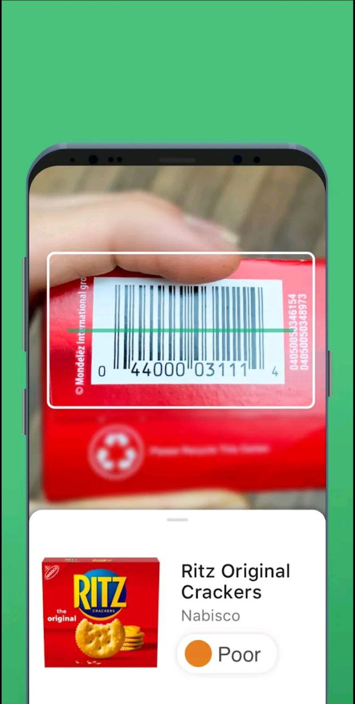
    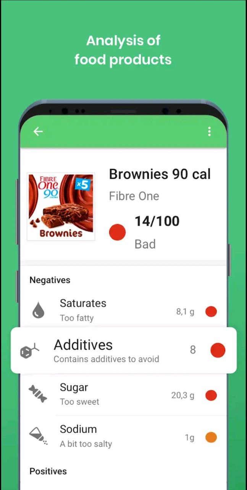

#### Ingredio
- **Points Forts**:
    - Focalisée sur les ingrédients
    - Scan des ingrédients via OCR
- **Points Faibles**:
    - Interface améliorable
    - Pauvre en fonctionnalités

    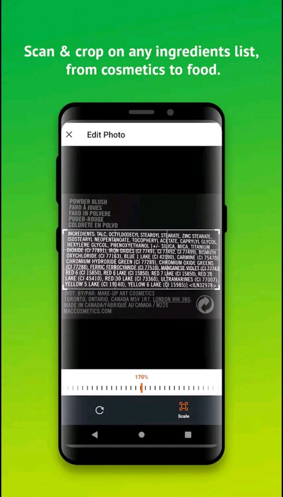
    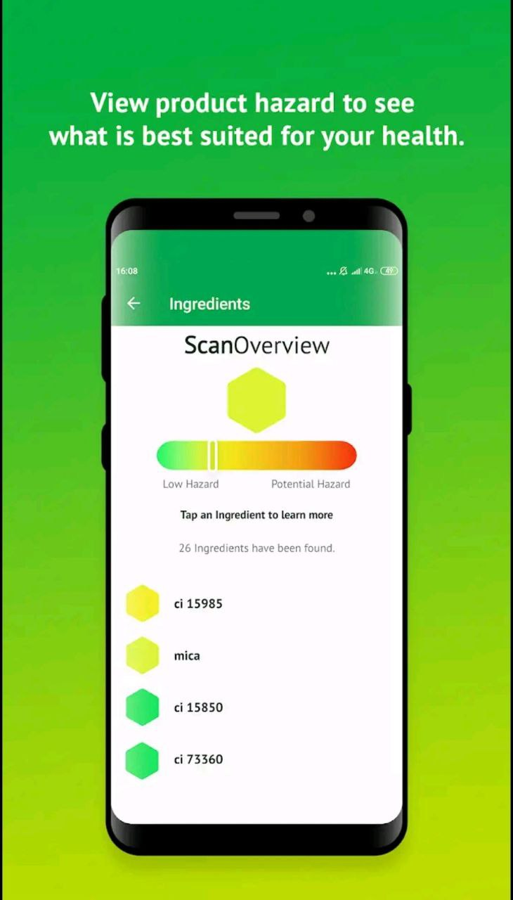

## 🎯 Public Cible

Food Guardian s'adresse à tous les amateurs de nourriture soucieux de leur santé et de leur bien-être. Cette application est un incontournable pour les personnes aux prises avec des allergies et des intolérances alimentaires, offrant une tranquillité d'esprit lors des courses. Les familles préoccupées par la qualité des aliments qu'elles consomment trouveront en Food Guardian un allié précieux pour veiller à la sécurité et à la santé de leurs proches. Les voyageurs, soucieux de décoder les étiquettes à l'étranger, apprécieront la facilité avec laquelle l'application traduit les ingrédients. En somme, Food Guardian s'adresse à toute personne désireuse de consommer de manière éclairée, informée et sécurisée.

## 📋 Fonctionnalités

### Déscription des Personas

- **Marc (utilisateur non identifié)** :
  Marc est un jeune homme dynamique et curieux, passionné par la découverte de nouvelles technologies. Utilisateur occasionnel, il cherche avant tout une expérience utilisateur fluide et intuitive. Soucieux de sa santé, il souhaite obtenir rapidement des informations claires sur les produits alimentaires pour faire des choix éclairés, mais il n'est pas encore engagé dans une utilisation régulière de l'application.

- **Maria (utilisatrice identifié)** :
  Maria est une professionnelle active et préoccupée par sa santé et son bien-être. Utilisatrice régulière de l'application, elle est consciente de ses allergies et intolérances alimentaires. Maria cherche à adapter au mieux les fonctionnalités de l'application à ses besoins spécifiques pour faciliter ses choix alimentaires au quotidien. Elle accorde de l'importance à une expérience personnalisée et à des informations précises pour prendre des décisions en toute confiance.

### Utilisation en tant qu'anonyme :

- [x] En tant que **Marc (utilisateur non identifié)**, je souhaite découvrir l'application sans un compte afin de ne pas devoir m'enregister pour voir ce qu'offre l'application.
- [x] En tant que **Marc (utilisateur non identifié)**, tester le scan de code barre, pour découvrir si le fonctionnement me convient

### Enregistrement et profils des utilisateurs :

- [x] En tant que nouvel utilisateur, je souhaite créer un compte avec mon adresse électronique et mon mot de passe, afin de pouvoir personnaliser mes préférences en matière d'allergènes.
- [x] En tant qu'utilisateur, je souhaite modifier mon profil pour préciser mes allergies, intolérances et préférences alimentaires.
- [x] En tant qu'utilisateur, je souhaite réinitialiser mon mot de passe en cas d'oubli.

    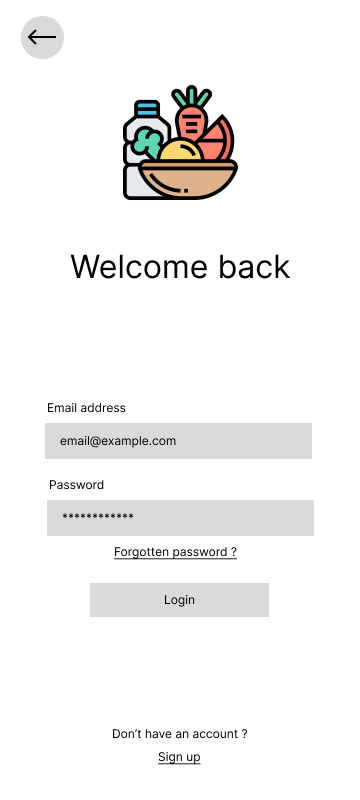
    
    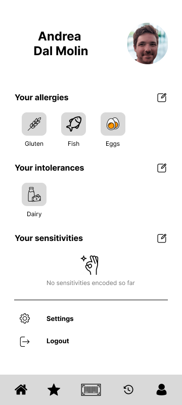

### Lecteur de codes-barres :

- [x] En tant que **Maria (utilisatrice identifié)**, je veux scanner le code-barres d'un produit alimentaire pour obtenir des informations détaillées.
- [x] En tant que **Maria (utilisatrice identifié)**, je veux que le scanner fonctionne rapidement et avec précision, afin d'obtenir des résultats instantanés.
- [x] En tant que **Maria (utilisatrice identifié)**, je veux que l'application reconnaisse et gère différents formats de codes-barres.

    

### Détection des allergènes :

- [x] En tant que **Maria (utilisatrice identifié)**, allergique aux arachides, je veux que l'application m'alerte lorsqu'un produit scanné contient des arachides ou des ingrédients dérivés des arachides.
- [x] En tant **Maria (utilisatrice identifié)**, souffrant d'une intolérance au lactose, je veux que l'application m'informe de la présence d'ingrédients contenant du lactose dans les produits scannés.
- [x] En tant **Maria (utilisatrice identifié)**, ayant des préférences alimentaires spécifiques, je souhaite que l'application me permette de personnaliser les ingrédients que je considère comme des allergènes.

    
    

### Détails du produit :

- [x] En tant **Maria (utilisatrice identifié)**, je veux voir la liste complète des ingrédients d'un produit scanné.
- [x] En tant **Maria (utilisatrice identifié)**, je veux voir les valeurs nutritionnelles d'un produit scanné.
- [ ] En tant **Maria (utilisatrice identifié)**, je veux lire les commentaires et les évaluations des utilisateurs sur les produits afin de prendre des décisions éclairées.

    

<!--
### Alertes utilisateur :

- [ ] En tant qu'utilisateur, je veux recevoir des alertes immédiates lorsqu'un produit scanné contient des allergènes que je dois éviter.
- [ ] En tant qu'utilisateur, je veux pouvoir supprimer les alertes après les avoir lues.
- [ ] En tant qu'utilisateur, je veux avoir accès à l'historique des alertes passées.

### Recherche et filtrage de produits :

- [ ] En tant qu'utilisateur, je veux rechercher des produits par nom ou par marque.
- [ ] En tant qu'utilisateur, je veux appliquer des filtres pour trouver des produits qui correspondent à mes préférences alimentaires.
- [ ] En tant qu'utilisateur, je souhaite trier les résultats de la recherche en fonction de la pertinence, du prix ou des évaluations des utilisateurs.

### Avis et évaluations des utilisateurs :

- [ ] En tant qu'utilisateur, je veux laisser mon propre avis et ma propre évaluation sur un produit.
- [ ] En tant qu'utilisateur, je veux lire ce que d'autres ont dit sur les produits qui m'intéressent.
- [ ] En tant qu'utilisateur, je veux avoir la possibilité de signaler les avis inappropriés ou inexacts. 
-->
### Produits favoris et historique :

- [x] En tant **Maria (utilisatrice identifié)**, je souhaite enregistrer mes produits favoris dans mon profil pour pouvoir m'y référer ultérieurement.
- [x] En tant **Maria (utilisatrice identifié)**, je veux pouvoir accéder facilement à ma liste de produits favoris.
- [ ] En tant **Maria (utilisatrice identifié)**, je veux pouvoir supprimer des produits de ma liste lorsque je n'en ai plus besoin.

    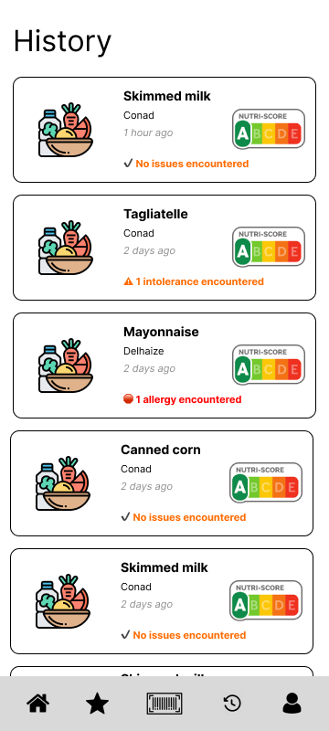

### Recommandations :

- [ ] En tant **Maria (utilisatrice identifié)**, je veux que l'application me suggère des produits alternatifs qui correspondent à mes préférences en matière d'allergènes et à mes restrictions alimentaires.
- [ ] En tant **Maria (utilisatrice identifié)**, je veux savoir pourquoi un produit spécifique m'est recommandé.

### Paramètres :

- [ ] En tant **Maria (utilisatrice identifié)**, je veux personnaliser les paramètres de l'application, tels que les notifications et les préférences linguistiques.
- [ ] En tant **Maria (utilisatrice identifié)**, je veux gérer les informations de mon compte et les paramètres de confidentialité.
- [ ] En tant **Maria (utilisatrice identifié)**, je veux contrôler les options d'accessibilité de l'application pour les adapter à mes besoins.

## 📈 État d'Avancement

### Utilisation en tant qu'anonyme :

- [x] En tant que **Marc (utilisateur non identifié)**, je souhaite découvrir l'application sans un compte afin de ne pas devoir m'enregister pour voir ce qu'offre l'application.
- 

    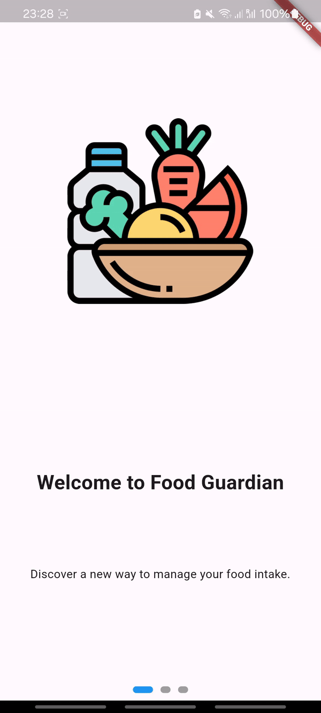

- [x] En tant que **Marc (utilisateur non identifié)**, tester le scan de code barre, pour découvrir si le fonctionnement me convient

    

### Enregistrement et profils des utilisateurs :

- [x] En tant que nouvel utilisateur, je souhaite créer un compte avec mon adresse électronique et mon mot de passe, afin de pouvoir personnaliser mes préférences en matière d'allergènes.
- [x] En tant qu'utilisateur, je souhaite modifier mon profil pour préciser mes allergies, intolérances et préférences alimentaires.
- [x] En tant qu'utilisateur, je souhaite réinitialiser mon mot de passe en cas d'oubli.

    
    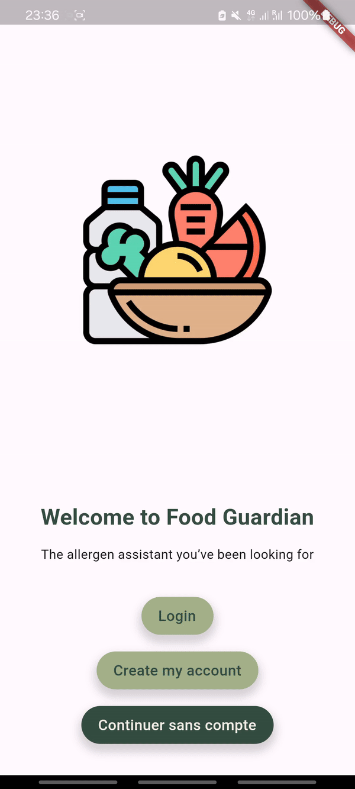
    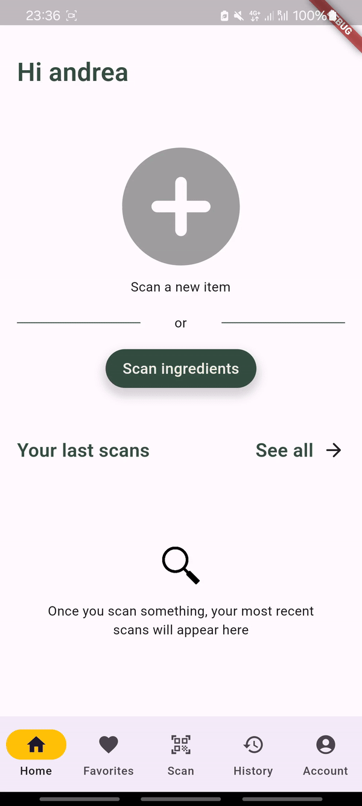

### Lecteur de codes-barres, détection des allergènes:

    

### Produits favoris et historique :

- [x] En tant **Maria (utilisatrice identifié)**, je souhaite enregistrer mes produits favoris dans mon profil pour pouvoir m'y référer ultérieurement.
- [x] En tant **Maria (utilisatrice identifié)**, je veux pouvoir accéder facilement à ma liste de produits favoris.

    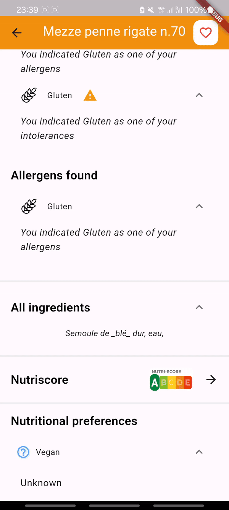

## ⚙️ Compilation de l'Application

L'application a été développer sous l'environnement suivant:

- Dart SDK version: 3.1.4 (stable)
- Flutter 3.13.8

Par conséquent, il est fortement recommandé de se prémunir des mêmes version pour faire tourner l'application.

Le code peut être téléchargé simplement en faisant un `git clone` de ce projet.

Pour faire tourner le project, à l'ouverture de celui-ci, il faut se placer avec un terminal dans le sous-dossier `code/food_guardian` et lancer la commande `flutter pub get`
pour importer le dépendences.

Une fois ces étapes réalisé, vous avez deux choix:
- Soit lancer l'application via un AVD pour faire tourner l'application sur un téléphone virtuel
- Soit (recommandé) activer le mode debug sur votre téléphone (Android bien entendu) pour faire tourner FoodGuardian depuis votre téléphone.